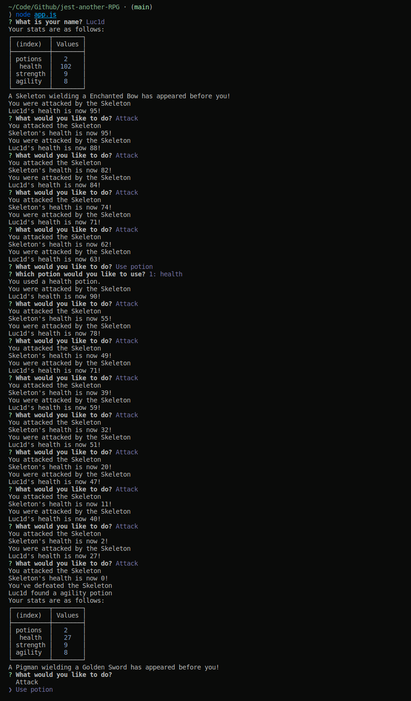

## jest another RPG

Command line RPG written in Node.js following the Test Driven Development model with jest.

#### Issues

- [x] [Create a Potion object](https://github.com/MBrassey/jest-another-RPG/issues/1)
- [x] [Create a Player object](https://github.com/MBrassey/jest-another-RPG/issues/2)
- [x] [Create an Enemy object](https://github.com/MBrassey/jest-another-RPG/issues/3)
- [x] [Create a Game object](https://github.com/MBrassey/jest-another-RPG/issues/4)
- [x] [Consolidate the code](https://github.com/MBrassey/jest-another-RPG/issues/5)

#### Requirements

- node.js
- npm

#### Installation

    npm i

#### Usage

    Usage: node app.js [ -h | -v | -l | -a ]

    [options]

    -h          Display this message.
    -v          Show version.
    -l          Show license info.
    -a          What is jest-another-RPG?

[
](https://brassey.io/)

#### Questions

Contact me at [matt@brassey.io](mailto:matt@brassey.io) with any questions or comments.

#### License

`jest-another-RPG` is published under the **CC0_1.0_Universal** license.

> The Creative Commons CC0 Public Domain Dedication waives copyright interest in a work you've created and dedicates it to the world-wide public domain. Use CC0 to opt out of copyright entirely and ensure your work has the widest reach. As with the Unlicense and typical software licenses, CC0 disclaims warranties. CC0 is very similar to the Unlicense.
